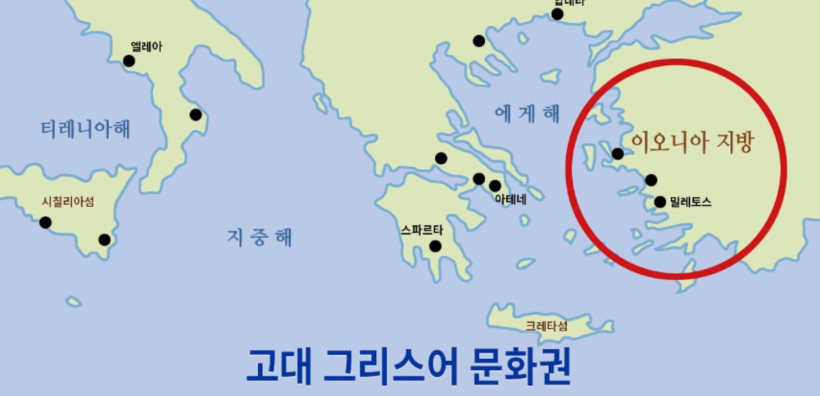

# 탈레스(BC 625? ~ BC 546?) ; 최초의 자연철학자
흔히 고대 서양철학은 소크라테스(BC 470 ~ BC 399), 플라톤(BC 427 ~ BC 347) 같은 유명한 사람들이 먼저 언급된다.  

하지만, 이보다 앞 선 최초의 철학자가 바로 탈레스이고 **_자연철학_** 자로 분리된다.

  
탈레스가 태어난 밀레투스란 지역은 4대 문명의 하나인 유프라테스 - 티그리스 문명이 싹튼 곳이다.  
문명의 탄생지 부근에서 자연철학자들은 하늘과 별, 계절, 날씨 등에 민감할 수 밖에 없다.  
(_주변에 보이는게 자연뿐이니까.._)

## 자연철학(신에게서 철학으로)
자연철학 이전의 사람들은 자연재해를 신의 분노로, 풍년을 신의 은총으로 받아들이곤 했다.  
하지만, 탈레스는 나일강의 범람을 북쪽에서 불어오는 계절풍의 영향이라고 생각했다.  

지금의 과학으론 나일강의 범람은 에티오피아 고원 일대에 내린 집중호우가 몇 개월 뒤 시차를 두고  
나타나는 현상이지만, 자연철학은 신으로부터 벗어났다는데에 그 의의가 있다.  

신이란 존재에서 벗어나 나름의 논리적인 사고로 **과학적 접근을 했다**는 것에 가장 큰 의의가 있다. 

## 만물은 물이다(최초의 환원주의)
탈레스는 이 밖에도 **_'만물의 근원은 무엇인가?'_** 라는 질문을 던졌다.  
탈레스는 만물의 근원이 물이라고 생각했다.

세계의 근원은 무엇인가? 라는 질문에 탈레스 이전에는 신의 산물로서, 그 답을 신화에서 찾았다.  
탈레스는 신화에서 벗어나 세계의 본성을 찾고자 탐구를 시작한 인물이다.

환원주의(還元主義, reductionism)는 사전적 의미로는  
'복잡하고 높은 단계의 사상이나 개념을 하위 단계의 요소로 세분화하여 명확하게 정의할 수 있다고 주장하는 견해'이다.

탈레스의 '만물은 물이다' 라는 답변은 최초의 환원주의로 정의할 수 있다.

## 과학자, 수학자, 철학자
고대 철학자 대부분이 과학자이자 철학자, 수학에 정통했던것처럼 탈레스 또한 과학자이자 수학자였다.  
'비례'의 개념을 정확하게 이해하고 피라미드의 높이를 계산해냈다.

또한, 해와 달의 움직임을 관찰하고 일식을 예견하는 등 수학적으로도 매우 정통한 사람이었다.

### 생각해보자
과학의 발전으로 만물의 근원은 물이 아니라는 것은 당연히 알고있다.  
그럼에도 불구하고 탈레스를 무시하면 안되는 것은  
당시 시대의 과학적인 접근이야 말로 진정한 진리였을 수도 있기 때문이다.

가령, 미래의 사람들은 지금 시대의 사람들을 비웃을 날이 올지도 모른다.  
"2000년대 사람들은 모든 물질이 쿼크로 이루어졌다고 생각했데ㅋㅋ" 이러면서 말이다.

어쩌면 지금도 탈레스가 던진 '만물의 근원은 무엇인가?' 라는 질문에  
아직도 우리는 그 답을 찾고있는 것일수도 있다.
