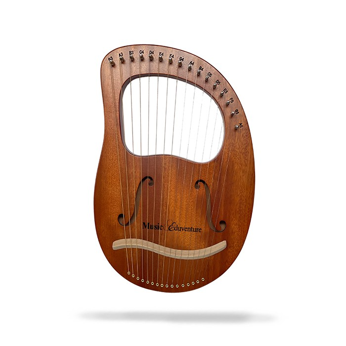

# 피타고라스(BC 570 ~ BC 495)
직각 삼각형에서 빗변 길이의 제곱은 빗변을 제외한 두 변의 각각 제곱의 합과 같다
(a2 + b2 = c2)  
피타고라스 정리의 바로 그 피타고라스이다.

## 만물은 수(數)이다
피타고라스는 만물이 수(숫자)로 구성되어 있다고 생각했다.  
대장간의 뚝딱거리는 소리를 듣고 그 소리가 불편하다고 생각했다.  
피타고라스는 이런 점이 이상하다고 생각했고, '리라'라는 악기의 현을 가지고 실험한 결과,  
특정 비율의 진동수가 있는 소리는 듣기가 좋고, 그 반대의 경우에는 듣기 좋지 않다는 사실을 알게되었다.  
두 줄의 진동수 비율이 1 대 2, 2대 3, 3대 4 처럼 간단한 정수비가 될 때 조화롭고 듣기 좋은 소리가 난다는 사실을 **발견**했다.  

피타고라스는 천체 운동도 수의 조화로 생각했다.  
탈레스로 부터 시작된 많은 자연철학자들은 만물은 물이다, 공기다 등의 자연적인 산물로 생각했다.  
하지만 피타고라스는 만물의 구성요소가 무엇인지에 집중한 것이 아니라 구성원리(수적 관계)에 주목했다.

이러한 생각은 현재까지 이어져 아인슈타인의 특수상대성이론에 따르면 시간지연 현상을 수식으로 표현할 수 있고,  
현대 물리학에서는 힘, 속도, 무게, 시간, 공간 등등 많은 자연적인 현상들을 수로 표현할 수 있다.  

## 피타고라스와 히파수스(루트2 살인사건)
피타고라스는 많은 추종자를 거느리고 있었고, 종교로 추앙될 만큼 높은 지위를 가지고 있다고 한다.  
많은 연구 끝에 피타고라스는 무리수의 존재에 대해 발견하게 되었지만, 우주는 조화롭고 그 이유는 수적관계로 생각했기 때문에  
딱 안떨어지는 무리수의 발견은 그리 달갑지만은 않았다.

제자들에게 무리수의 발견을 비밀에 부치도록 했지만, 히파수스라는 제자는 이 무리수의 존재에 대해 따로 발견하게 되었고,  
피타고라스에게 인정받고 싶어서 무리수의 존재에 대해 동네방네 떠들고 다녔다.  
피타고라스는 제자들에게 히파수스를 처리하라고 지시했고, 바다에 빠뜨려 죽이게 된다.

### 생각해보자
첫번째로는 조화로운 음계에 대해서 보편적으로 편안하게 느낀다는 점이다.  
과거에도 좋은 음악은 현재에서도 좋게 느껴진다.  
하지만 어떤 음계의 조화가 좋게 느껴진다는것 자체가 어떻게 보면 이상한 일 일수도 있다.

**_왜 특정 음계의 조합은 과거에도 현재에도 좋게 느껴지는가?_**  
피타고라스는 어떻게 음계의 조합이 조화롭게 들리는 지 '진동수 비율'로 증명해냈지만,  
내가 궁금한 것은 왜 진동수 비율이 정수비가 될 때 조화롭게 들리는 지 이다. 그것도 모든 사람들이 거의 동일하게 말이다..  

심지어, 클래식을 들으며 자란 동물들은 품질이 좋다는 연구결과도 있는 것을 보더라도  
만약 신이 인간을 비롯한 동식물을 설계했다면,  
왜 특정 진동수 비율에 평안함을 느끼게 만들었는 지 그 이유가 궁금해졌다..